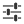

# Way selected

Way selection is described in the [Introduction](../en/Introduction.md). Selected ways can be moved by dragging. You can also edit tags for selected ways.

## Actions  

Note: some of these actions will only be visible if they can actually be executed on the selected way. For example you can only split a way that has more than two way nodes.

###  Undo

Tapping the icon once will undo the last operation. A long press will display a list of the operations since the last save, if you have undone anything a corresponding "redo" action will be displayed. If the undo results in the current selected object being removed you will be returned to the main screen. *Some operations consist of multiple simpler actions that will be listed as individual items.*

###  Properties

Starts the property editor on the current selection.

###  Todos

If the selected element is associated either with a todo or osmose task this menu will be displayed.

Available actions are

#### Close and goto next

Close a todo associated with the element and goto the nearest open todo in the list. If the element is present in multiple todo list a modal will ask which one to choose.

#### Skip and goto next

Skip a todo associated with the element and goto the nearest open todo in the list. If the element is present in multiple todo list a modal will ask which one to choose.

#### Close all

Close all todos and osmose bugs associated with the element. 

###  Add address tags

Adds address tags with prediction. Only visible if way is tagged as building.

###  Reverse way

Reverse the direction of the way. If the way has direction dependent tags it will automatically change them to still have the same effect as before the direction change with the exception of _oneway_ tags as the assumption is that the intent was to actually change the direction of the one way street. If any such tags are present, including _oneway_ a warning dialog will be shown and you can change the tag manually if necessary. Direction dependent tags currently handled are:
				
* direction
* incline
* \*:left, \*:right, \*:left:\*, \*:right:\*, left and right
* \*:backward, \*:forward, \*:backward:\*, \*:forward:\*, backward and forward
* forward and backward roles in relations the selected way is a member of

###  Split

Split the selected way. The nodes at the available locations for splitting will have a visible touch area. The "Split" action is only available if the way has more than two nodes. If the way is closed you will need to select two nodes. For non-closed ways a long touch on the node to use for splitting will allow you to select which part of the original way will be used for the new way.

###  Merge

Join the selected way with one that it shares a node with resulting in a single way. This option will only be available if the ways have compatible tags and relation memberships.

###  Append 

Append to the current selected way. Touch areas will be visible around nodes that can be used to extend the way, select "Done" or the same node twice to stop. The "Append" action is only available if the way in question is not closed.

###  Add turn restriction 

Start creating a turn restriction with this way as "from" member. This action is only available if the way in question has a "highway" tag. Ways will be split automatically during the process.

### Create route

Start creating a route relation with the current way as the first route segment. See [Add route segment](Add%20route%20segment.md).

### Add to route

Add the current way to an existing route (the route needs to be present in the downloaded data). See [Add route segment](Add%20route%20segment.md).

###  Square

For closed ways (polygons). Change angles that are near 90° or 180° to 90° or 180° respectively. The threshold over which angles are not changed can be set in the [Advanced preferences](Advanced%20preferences.md).

###  Straighten

Change angles that are near 90° or 180° to 90° or 180° respectively. The threshold over which angles are not changed can be set in the [Advanced preferences](Advanced%20preferences.md).

###  Rotate

Rotate the way around its centroid. The centroid position is marked with a cross.

### Split in to polygons

Available for closed ways with at least four nodes. Will split the way in to two polygons, sharing the common nodes.

### Remove node from way

This will remove a node from the selected way. If the node is untagged and not a member of any other way the node will be deleted, otherwise it will remain in the data.

### Unjoin

Available if the way shares nodes with other ways. This function replaces all shared nodes with new copies of the original nodes, disconnecting the way from all of other ways.

### Unjoin dissimilar

As __Unjoin__ with the difference that nodes that are shared with ways that have the same "top level" or "primary" key will be replaced in those ways effectively maintaining the connections to similar ways. If the way is tagged with multiple "primary" keys you will be asked to select which one to use for the comparison. 

### Extract segment

Extracts a single node to node way segment from the selected way, after clicking on it and offers appropriate tagging via buttons. For example a highway segment can be extracted and given bridge or tunnel attributes with a small number of actions.

### Select way nodes

Selects all nodes in the way, de-selects the way and starts [Multiselect](Multiselect.md) mode.

### Start/End of Way

Go to the end or start of the selected way.

###  Copy

Copy the way to the internal copy and paste buffer.

###  Duplicate

Create a copy of the selected way in the same location. This does not utilize the copy and paste buffer.

### Shallow duplicate

Create a copy of the selected way with the same way nodes. This does not utilize the copy and paste buffer.

###  Cut

Move the way to the internal copy and paste buffer removing it from the data.

### Paste tags

Set tags from the internal tag clipboard and start the property editor.

###  Delete

Remove the object from the data.

###  Extend selection

Start [Multiselect](Multiselect.md) mode with the current selected element.

###  Create relation

Create a relation and add this object as the first element. The relation type can be selected from a list generated from the available presets. Further objects can be added until the check button is clicked, then the tag editor will be started on the new relation. 

### Add to relation

Select a relation and add this object as a member. Further objects can be added until the check button is clicked, then the tag editor will be started on the relation. 

###  Info

Show a screen with some detailed information on the selected object.

### Zoom to selection

Pan and zoom the map to the currently selected object.

### Search for objects

Search for OSM objects in the loaded data using JOSMs search expressions.

### Add to todo list

Add the current selection to an existing or new todo list.

### Replace geometry

Replace the geometry of the current way with that of a  (in a second step) selected way, the algorithm tries to reuse the nodes in the way as best as possible. Tagged nodes in way will be moved up to an adjustable maximum (default 1m, this can be changed in the [Advanced preferences](Advanced%20preferences.md)), if they would have to be moved more they will be extracted from the way to give the user a chance to position them correctly. 

### Add new image

Start the camera app and upload the resulting image, adding an appropriate tag to the OSM element. Currently Panoramax and Wikimedia Commons targets are supported, 
you do need to configure and authorize access to the servers in the [Advanced preferences](Advanced%20preferences.md#image-storage).

### Add existing image

As [Add new image](#add-new-image) but allows you to select an existing image for upload.

### Upload element

Upload the selected element (only available for a new or modified element).

### Share position

Share the position of the selected object with other apps on the device.

###  Preferences

Show the user preference screens. The settings are split into two sets: the first screen contains the more commonly used preferences, the "Advanced preferences" contains the less used ones. 

###  Help

Start the Vespucci Help browser
