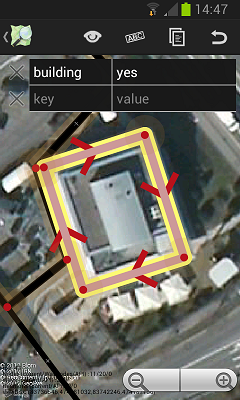
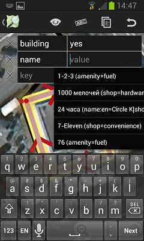
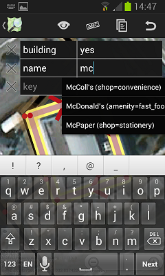
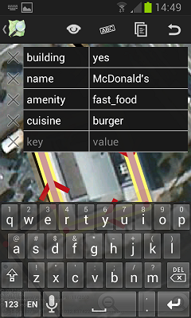
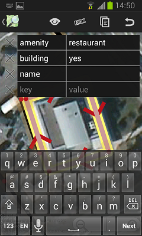
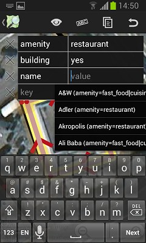
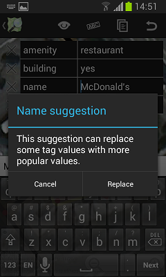

# Using Name Suggestions
_by Simon Poole_

The iD editor has used the [name suggestion index](https://github.com/osmlab/name-suggestion-index) for quite a while and it was something that I wanted to support in vespucci in the upcoming release. The one thing you do want to reduce in a mobile app is typing.

Basically the idea is to suggest correct spelling (and tagging) for some of the more prominent chains of restaurants and shops to the mapper. The way it works in vespucci now is slightly different from the current implementation in iD and at least some aspects might be worthwhile supporting there too.

_The screen shots below are from version 0.9.4, while the layout changed in 0.9.6 and later, the functionality remains the same._

## Using the name as a short cut for tagging

If you are creating a new object, or adding tags to an object that previously didn't have relevant tags, you can use the name as an "Ersatz"-preset (note vespucci supports normal JOSM-style presets too and there is an "advanced preferences" to automatically apply the best JOSM preset):

 Enter the name tag | Start typing  and get the auto-complete list | Further typing refines the list | Selecting the correct item sets the name and the corresponding tags 
------------------- | ------------------------------------------- | ------------------------------- | ------------------------------------------------------------------
  |  |  |    

## Adding the name to a "pre-tagged" object

In the example the building has already been pre-tagged with amenity=restaurant, which while not really wrong is not the best tagging for a fast food restaurant. 

 Enter the name tag | Start typing and get the auto-complete list | Select the correct name after further refinement
 ------------------ | ------------------------------------------- | ------------------------------------------------
  |  | 
                                                | This includes suggestions not just for amenity=restaurant but for potentially further refined tagging. | Vespucci now asks for confirmation if the old tags should be replaced.

This functionality is available in the 0.9.4 and later releases.
