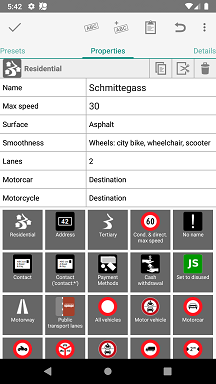

## Vespucci Preset System
_Documentation for Vespucci 11.1_

As explained in the [help documentation](../help/en/Presets.md) Vespucci uses JOSM compatible presets, currently any preset used in JOSM should simply work with Vespucci, however there can be differences. Particularly with the new preset driven tagging interface presets have become even more important and if you are writing presets yourself and want them to work well in Vespucci please keep on reading.

### Preset-Driven Tag-Editing in Vespucci

For the preset based editing to work Vespucci has to match the existing tags, including incomplete, key-only ones with the available presets. This is done in an iterative fashion: the best matching preset is found (weighting presets with fixed key-value tuples higher than such with variable values), then all tags that can be found in linked presets are added (no separate header displayed) and this process is repeated until their are either no tags left or no preset match can be found.  

### Supported JOSM Preset Elements and Attributes

Note: this is loosely based on what [JOSM claims](https://josm.openstreetmap.de/wiki/TaggingPresets) to works, this may, and actually likely is, different from the actual implementation. Language specific attributes are ignored (see [Translation](#Translation)). "supported" doesn't necessarily imply the same behaviour as JOSM, simply that Vespucci will do something useful with the value. Icons currently must be in PNG format.

Element            | Attributes                     | Support   | Notes
-------------------|-------------------------------|-----------|----------------------------------------------------------------
__&lt;presets&gt;__          |                     |           |
                             | author              | ignored   |
                             | version             | ignored   |
                             | description         | ignored   |
                             | shortdescription    | ignored   |
                             | link                | ignored   |
                             | icon                | ignored   |
                             | baselanguage        | ignored   |
                             | object_keys         | extension | comma separated list of top-level keys  
__&lt;!-- comment --&gt;__   |                     | ignored   |
__&lt;group&gt;__  |                               | supported |
                   | name                          | supported | required
                   | name_context                  | supported |
                   | icon                          | supported | you really should add one for Vespucci
                   | items_sort                    | extension | sort the items alphabetically, default "yes"
__&lt;item&gt;__   |                               | supported |
                   | name                          | supported | required
                   | name_context                  | supported |
                   | icon                          | supported | you really should add one for Vespucci
                   | type                          | supported |
                   | name_template                 | ignored   |
                   | preset_name_label             | ignored   |
                   | deprecated                    | extension | only use the preset for matching and map icon display 
__&lt;chunk&gt;__  |                               | supported | 
                   | id                            | supported | required
__&lt;reference&gt;__ |                            | supported |
                   | ref                           | supported | required
__&lt;key&gt;__    |                               | supported |
                   | value                         | supported | required
                   | match                         | partial | "none" is supported
                   | text		                   | extension | Something to display 
                   | values_context				   | extension | Translation context
__&lt;text&gt;__   |                               | supported |
                   | key                           | supported | required
                   | text                          | supported |
                   | match                         | partial   | only the "key", "key!" and "none" values are supported, all other values are ignored
                   | default                       | supported | 
                   | use_last_as_default           | ignored   | 
                   | auto_increment                | ignored   |
                   | length                        | ignored   |
                   | alternative_autocomplete_keys | ignored   |
                   | javascript                    | extension | if value is not set, execute the JS script
                   | i18n                          | extension | if set to true this tag has i18n variants
                   | value_type                    | extension | indicate the kind of value this tag should have
__&lt;combo&gt;__  |                               | supported |
                   | key                           | supported | required
                   | text                          | supported |
                   | text_context                  | supported |
                   | values                        | supported |
                   | values_sort                   | supported |
                   | delimiter                     | supported |
                   | default                       | supported |
                   | match                         | supported |
                   | display_values                | supported |
                   | short_descriptions            | partial   | will only be used if display_values is not present
                   | values_context                | supported |
                   | editable                      | supported | default is "false"
                   | use_last_as_default           | ignored   |
                   | values_searchable             | supported | subtype values are added regardless of the setting
                   | length                        | ignored   |
                   | values_no_i18n                | ignored   |
                   | values_from                   | supported | extension: if the target method supports a String argument the current key will be passed
__&lt;multiselect&gt;__ |                          | supported |
                   | key                           | supported | required
                   | text                          | supported |
                   | text_context                  | supported |
                   | values                        | supported |
                   | values_sort                   | supported |
                   | delimiter                     | supported |
                   | default                       | supported |
                   | match                         | supported |
                   | display_values                | supported |
                   | short_descriptions            | partial   | will only be used if display_values is not present
                   | values_context                | supported |
                   | editable                      | supported | default is "false"
                   | use_last_as_default           | ignored   |
                   | values_searchable             | supported | subtype values are added regardless of the setting
                   | length                        | ignored   |
                   | values_no_i18n                | ignored   |
                   | values_from                   | supported | extension: if the target method supports a String argument the current key will be passed
                   | rows                          | ignored   |
__&lt;list_entry&gt;__       |                     | supported |  
                   | value                         | supported | required 
                   | display_value                 | supported |
                   | short_description             | supported |
                   | icon                          | supported |
                   | icon_size                     | ignored   |
__&lt;checkgroup&gt;__       |                     | supported |
                   | columns                       | ignored   |
                   | text                          | extension |
                   | text_context                  | extension |
__&lt;check&gt;__  |                               | supported |
                   | key                           | supported | required
                   | text                          | supported |
                   | text_context                  | supported |
                   | value_on                      | supported |
                   | value_off                     | supported | 
                   | disable_off                   | supported |
                   | default                       | supported |
                   | match                         | supported | 
__&lt;label&gt;__  |                               | ignored   |
__&lt;space/&gt;__ |                               | ignored   |
__&lt;optional&gt;__ |                             | supported | doesn't display anything
                   | text                          | ignored   |
__&lt;separator/&gt;__ |                           | supported | starts a new row in the preset selection display
__&lt;item_separator/&gt;__ |                      | ignored   |
__&lt;link&gt;__   |                               | supported |
                   | href                          | supported | including language specific variants
                   | wiki                          | supported | this will be used with lower preference than href entries
__&lt;roles&gt;__  |                               | ignored   | but not the included <role> elements
__&lt;role&gt;__   |                               | supported |
                   | key                           | supported | required
                   | text                          | supported |
                   | text_context                  | supported | 
                   | requisite                     | ignored   |
                   | count                         | ignored   |
                   | type                          | supported |
                   | member_expression             | ignored   | 

                 
### Translation 

While the preset specification includes language specific text by prefixing the keys with the two letter ISO code, for example _de.text_, in practical terms this doesn't really work. Particularly if lots of languages are in use, the preset file itself would explode in size, become essentially illegible and force the application to parse many 100's if not 1000's of attributes for languages it is not interested in. 

For Vespucci I've chosen a different approach based on [GNU gettext](https://www.gnu.org/software/gettext/manual/gettext.html) format files, the simple [Preset2Pot](https://github.com/simonpoole/beautified-JOSM-preset/tree/master/src/ch/poole/presetutils) utility will generate a .pot file from a preset which you can use with one of the translation services to produce GNU gettext compatible translations of all the strings in the preset (excluding the actual key and value strings).
                 
### Extensions

* _deprecated_ only use this preset for matching, do not offer it for new use and do not find it when searched
* _javascript_ execute the script if the value of this tag is empty, the script has access to and can modify the current tags and use the specified default value if any
* _i18n_ the tag can have i18n variants, for example name and name:de
* _object\_keys_ comma separated list of top level keys, examples would be highway, amenity etc., use this if your preset is introducing new such keys, see the [https://github.com/simonpoole/xmas-preset](xmas preset) for an example
* _value\_type_ type of the value: 

    * _opening_hours_ a normal opening hours syntax tag
    * _opening_hours_mixed_ a tag with both text values and opening hours, examples: _fee_, _supervised_ and _lit_
    * _conditional_ conditional access tag
    * _integer_ a integer numeric value
    * _website_ an URL for a website
    * _phone_ a phone number
    * _wikipedia_ a wikipedia page
    * _wikidata_  a wikidata Q ref
  
  this avoids having to hardcode such properties in applications, see the [https://github.com/simonpoole/xmas-preset](xmas preset) for an example.
* _items_sort_ this controls sorting of items in groups, the default is "yes", any other value will disable sorting, the sorting preserves structure. Note: the preset root groups are currently not sortable.