---
hide:
  - navigation
---

# Videos

### Downloading and installing presets

[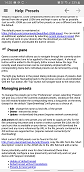](videos/install_downloaded_default_preset.mp4) Replace the default preset. 
[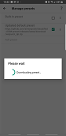](videos/update_downloaded_default_preset.mp4) Update the downloaded preset. 

### Downloading and configuring offline data

[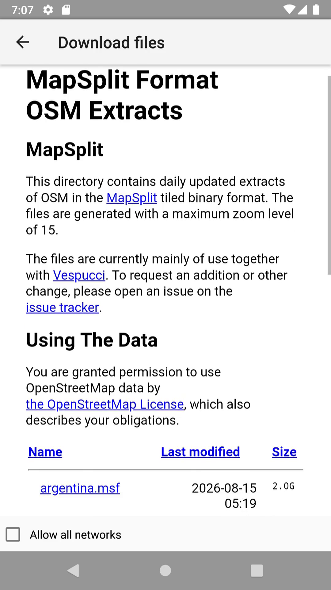](videos/download_and_configure_offline_data.mp4) 

# Screenshots

### Element selection
[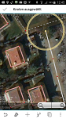](images/node-selected.png) [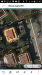](images/way-selected.png) [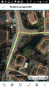](images/relation-selected.png)

### Property editor
[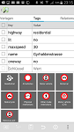](images/Tageditor-0.9.6.png) [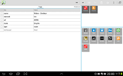](images/Tablet-layout-0.9.6.png)

### Notes/bugs
[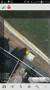](images/bug.png) [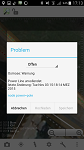](images/bug-display.png)

### Notifications
[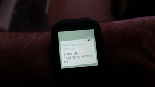](images/notification-data.jpg) [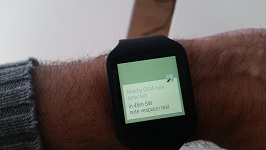](images/notification-note.jpg)

### Aligning imagery
[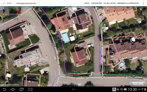](images/aligning-imagery.png)
