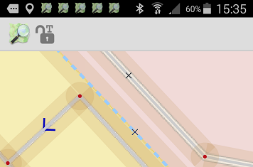

# Tag-only editing
_by Simon Poole_

No, this is not news. Vespucci has had a tag-only mode since its original creation in 2009, however since the old very modal user interface hasn't been the default UI after the work by Jan Schejbal in 2012 and the start of the 0.9 releases, it hasn't really been easily accessible.

Starting with 0.9.6 tag editing only mode can be switched on with a long press on the lock icon.

vespucci can still be locked/unlocked with a normal single touch on the lock and a long touch will get you back to normal editing mode.

Now while I personally don't quite see the utility of such a mode, users have asked for it and it is the only remains of the old modes that will [survive](https://github.com/MarcusWolschon/osmeditor4android/issues/215) in 0.9.7. In any case it is light years better than the many apps of different kinds that claim to offer simple editing but in general are survey apps on steroids that mess up existing data.
